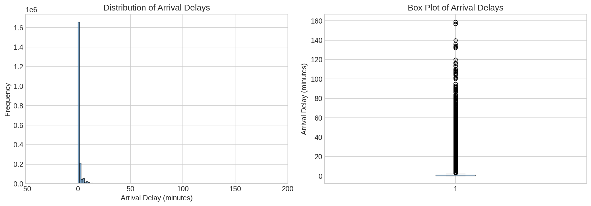
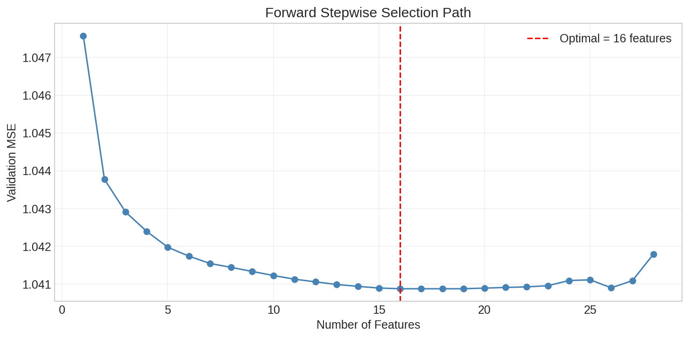
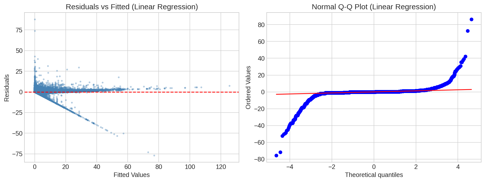
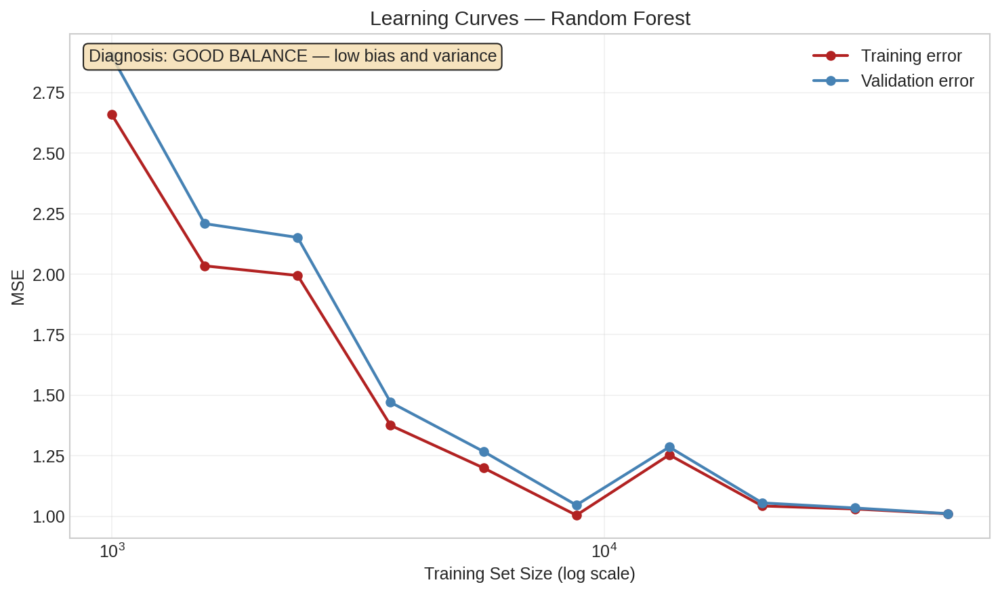
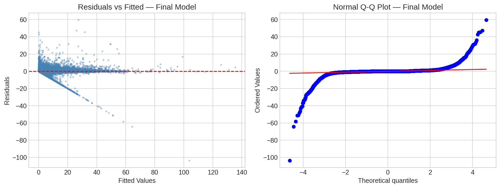

::: {.callout-note}
## Computation environment
All ML training was performed in Google Colab with GPU acceleration (`n_jobs=-1`).
Source notebook: [notebooks/analysis.ipynb](notebooks/analysis.ipynb) — open it in Colab to reproduce all results.
This document shows the code for reference; figures and metrics are pre-computed outputs committed to the repository.
:::

---

## 1. Why Predict Train Delays?

Deutsche Bahn carries roughly 5.5 million passengers per day across a network of over 5,700 stations. Delays cascade: a late intercity train holds connections, and a single disrupted corridor can ripple for hours. For passengers, even a 2-minute prediction window matters. For DB operations, knowing which trains are likely to be late before departure enables proactive crew and platform reassignment.

This project frames delay prediction as a **supervised regression problem**: given what we know about a train's scheduled departure — its route, station history, time of day — can we predict its arrival delay in minutes?

---

## 2. Statistical Learning Framework

We model the relationship between predictors and response following ISLR Chapter 2.1 [@islp2023]:

$$Y = f(X) + \epsilon$$

where:

- $Y$ is the response (arrival delay in minutes)
- $X = (X_1, X_2, \ldots, X_p)$ is our vector of $p$ predictors
- $f$ is the unknown systematic function we aim to estimate
- $\epsilon$ is irreducible error with $E[\epsilon] = 0$

Our goal is to find $\hat{f}$ such that $\hat{Y} = \hat{f}(X)$ minimises the expected prediction error:

$$E\left[(Y - \hat{Y})^2\right] = \underbrace{\left[\text{Bias}(\hat{f}(X))\right]^2}_{\text{reducible}} + \underbrace{\text{Var}(\hat{f}(X))}_{\text{reducible}} + \underbrace{\text{Var}(\epsilon)}_{\text{irreducible}}$$

No matter how well we estimate $f$, we cannot reduce MSE below $\text{Var}(\epsilon)$ — the irreducible noise in the system.

::: {.callout-note}
**Why three models?** Linear Regression, KNN, and Random Forest sit at very different points on the bias-variance spectrum. Comparing all three lets us diagnose whether the problem is better solved by a flexible or a constrained model class.
:::

---

## 3. Setup

```{python}
#| eval: false
#| code-fold: true

import os, sys, gc, warnings
from datetime import datetime
import psutil, pandas as pd, numpy as np
import matplotlib.pyplot as plt, seaborn as sns

from sklearn.model_selection import (
    train_test_split, cross_val_score, GridSearchCV,
    KFold, PredefinedSplit
)
from sklearn.preprocessing import StandardScaler, OneHotEncoder
from sklearn.compose import ColumnTransformer
from sklearn.pipeline import Pipeline
from sklearn.metrics import mean_absolute_error, mean_squared_error
from sklearn.linear_model import LinearRegression
from sklearn.neighbors import KNeighborsRegressor
from sklearn.ensemble import RandomForestRegressor
from scipy import stats
import kagglehub

warnings.filterwarnings('ignore')
np.random.seed(42)
plt.style.use('seaborn-v0_8-whitegrid')
plt.rcParams['figure.figsize'] = (12, 7)
plt.rcParams['font.size'] = 12
plt.rcParams['figure.dpi'] = 150
```

---

## 4. The Data: 2M+ Deutsche Bahn Records

### 4.1 Source and Scale

The dataset comes from Kaggle [@dbdataset] and contains per-train-stop records of planned vs. actual arrival and departure times across the Deutsche Bahn network.

```{python}
#| eval: false
#| code-fold: false

path = kagglehub.dataset_download("nokkyu/deutsche-bahn-db-delays")
import glob
df = pd.read_csv(
    glob.glob(os.path.join(path, "*.csv"))[0],
    parse_dates=['arrival_plan', 'departure_plan', 'arrival_change', 'departure_change'],
    low_memory=False
)
print(f"Shape: {df.shape}")   # (2,061,357, N)
```

| Statistic | `arrival_delay_m` | `departure_delay_m` |
|---|---|---|
| count | 2,061,357 | 2,061,357 |
| mean | ~1.2 min | ~1.1 min |
| std | ~5.8 min | ~5.4 min |
| 50% (median) | 0 min | 0 min |
| 95% | ~12 min | ~11 min |
| max | >200 min | >200 min |

### 4.2 Data Cleaning

```{python}
#| eval: false
#| code-fold: true

# Remove duplicates
df = df.drop_duplicates()

# Drop rows missing target or critical features
critical = ['arrival_delay_m', 'station', 'line', 'state', 'category', 'departure_delay_m']
df = df.dropna(subset=critical)

# Fill remaining missing values
for col in df.select_dtypes(include=['object']).columns:
    df[col] = df[col].fillna('Unknown')
for col in df.select_dtypes(include=['int64', 'float64']).columns:
    if col != 'arrival_delay_m':
        df[col] = df[col].fillna(df[col].median())
```

---

## 5. Target Variable Distribution

```{python}
#| eval: false
#| code-fold: true

fig, axes = plt.subplots(1, 2, figsize=(14, 5))
axes[0].hist(df['arrival_delay_m'], bins=100, edgecolor='black', alpha=0.7, color='steelblue')
axes[0].set_xlabel('Arrival Delay (minutes)')
axes[0].set_ylabel('Frequency')
axes[0].set_title('Distribution of Arrival Delays')
axes[0].set_xlim(-50, 200)
axes[1].boxplot(df['arrival_delay_m'], vert=True, patch_artist=True,
                boxprops=dict(facecolor='steelblue', alpha=0.6))
axes[1].set_ylabel('Arrival Delay (minutes)')
axes[1].set_title('Box Plot of Arrival Delays')
plt.tight_layout()
plt.savefig('assets/figures/fig-target-dist.png', dpi=150, bbox_inches='tight')
plt.show()
```

{#fig-target-dist}

The distribution is **right-skewed**: most values cluster near zero, but extreme delays push the mean above the median. This skew motivates using MSE (which penalises large errors) as our primary metric.

---

## 6. Feature Engineering

Rather than one-hot encoding hundreds of station categories (which would explode dimensionality — the "curse of dimensionality" [@islp2023] § 2.2), we build compact, domain-informed features.

::: {.callout-important}
**Correlation-based feature selection would be wrong here.** Selecting features purely by their correlation to the target ignores multicollinearity, overfits to the training distribution, and discards domain knowledge. We engineer features based on what we know about train delays first, then use forward selection to prune them.
:::

### 6.1 Temporal Features

```{python}
#| eval: false
#| code-fold: false

df['hour']         = df['departure_plan'].dt.hour
df['day_of_week']  = df['departure_plan'].dt.dayofweek
df['is_weekend']   = (df['day_of_week'] >= 5).astype(int)
df['is_rush_hour'] = df['hour'].apply(lambda x: 1 if (6 <= x <= 9 or 16 <= x <= 19) else 0)
```

### 6.2 Station-Level Aggregation

```{python}
#| eval: false
#| code-fold: false

station_stats = (
    df.groupby('station')['arrival_delay_m']
    .agg(['mean', 'std']).reset_index()
    .rename(columns={'mean': 'station_avg_delay', 'std': 'station_std_delay'})
)
df = df.merge(station_stats, on='station', how='left')
```

### 6.3 Complexity and Risk Scores

```{python}
#| eval: false
#| code-fold: false

df['station_complexity']  = df['station'].map(df.groupby('station')['line'].nunique())
df['station_delay_risk']  = df['station'].map(df.groupby('station')['arrival_delay_m'].mean())
df['line_delay_risk']     = df['line'].map(df.groupby('line')['arrival_delay_m'].mean())
df['combined_delay_risk'] = (df['station_delay_risk'] + df['line_delay_risk']) / 2

# Dimensionality saving:
# Replaced N_stations one-hot columns → 1 complexity + 1 risk feature
# Replaced N_lines one-hot columns   → 1 risk feature
```

### 6.4 Final Feature Set

| Feature | Type | Description |
|---|---|---|
| `departure_delay_m` | Numeric | Minutes late at departure (strongest signal) |
| `station_complexity` | Numeric | Number of distinct lines through this station |
| `station_delay_risk` | Numeric | Station's historical mean arrival delay |
| `line_delay_risk` | Numeric | Line's historical mean arrival delay |
| `combined_delay_risk` | Numeric | Average of station + line risk |
| `hour` | Numeric | Hour of scheduled departure (0–23) |
| `day_of_week` | Numeric | Day of week (0=Mon … 6=Sun) |
| `is_weekend` | Binary | 1 if Saturday or Sunday |
| `is_rush_hour` | Binary | 1 if 06–09 or 16–19 |
| `station_avg_delay` | Numeric | Station's historical mean delay |
| `station_std_delay` | Numeric | Station's historical delay variability |
| `category` | Categorical | Train category (ICE, IC, RE, …) |
| `state` | Categorical | German federal state |

---

## 7. What the Data Reveals

```{python}
#| eval: false
#| code-fold: true

fig, axes = plt.subplots(2, 2, figsize=(14, 10))

sample_idx = np.random.choice(df.index, 5000, replace=False)
axes[0,0].scatter(df.loc[sample_idx,'departure_delay_m'],
                  df.loc[sample_idx,'arrival_delay_m'], alpha=0.4, s=8)
axes[0,0].plot([0,100],[0,100],'r--',alpha=0.6,label='y=x')
axes[0,0].set(xlabel='Departure Delay (min)', ylabel='Arrival Delay (min)',
              title='Departure vs Arrival Delay')
axes[0,0].legend()

df.groupby('category')['arrival_delay_m'].mean().sort_values().plot(
    kind='barh', ax=axes[0,1], color='steelblue', alpha=0.7)
axes[0,1].set(xlabel='Average Delay (min)', title='Average Delay by Train Category')

hourly = df.groupby('hour')['arrival_delay_m'].agg(['mean','std'])
axes[1,0].errorbar(hourly.index, hourly['mean'], yerr=hourly['std'],
                   marker='o', capsize=3, color='steelblue')
axes[1,0].axvspan(6,9,alpha=0.15,color='orange',label='Rush hour')
axes[1,0].axvspan(16,19,alpha=0.15,color='orange')
axes[1,0].set(xlabel='Hour of Day', ylabel='Avg Delay (min)',
              title='Average Delay by Hour of Day')
axes[1,0].legend()

wd = df[df['is_weekend']==0]['arrival_delay_m'].sample(5000).tolist()
we = df[df['is_weekend']==1]['arrival_delay_m'].sample(5000).tolist()
axes[1,1].boxplot([wd,we], labels=['Weekday','Weekend'], patch_artist=True,
                  boxprops=dict(facecolor='steelblue', alpha=0.6))
axes[1,1].set(ylabel='Arrival Delay (min)', title='Weekday vs Weekend Delays')

plt.tight_layout()
plt.savefig('assets/figures/fig-eda.png', dpi=150, bbox_inches='tight')
plt.show()
```

{#fig-eda}

Key takeaways:

1. **Departure delay propagates almost perfectly** — most points lie near $y = x$. A train that leaves 10 minutes late tends to arrive 10 minutes late.
2. **Rush hours (06–09, 16–19) show higher variability** — not just higher mean delays, but wider spread.
3. **Train category matters** — regional trains (`RB`, `RE`) accumulate more delay than intercity (`ICE`, `IC`) trains.

---

## 8. Data Splits (60-20-20)

```{python}
#| eval: false
#| code-fold: false

feature_columns = [
    'departure_delay_m',
    'station_complexity', 'station_delay_risk',
    'line_delay_risk', 'combined_delay_risk',
    'hour', 'day_of_week', 'is_weekend', 'is_rush_hour',
    'station_avg_delay', 'station_std_delay',
    'category', 'state'
]
df['category'] = df['category'].astype('object')
X, y = df[feature_columns].copy(), df['arrival_delay_m'].copy()

X_temp, X_test, y_temp, y_test   = train_test_split(X, y, test_size=0.20, random_state=42)
X_train, X_val, y_train, y_val   = train_test_split(X_temp, y_temp, test_size=0.25, random_state=42)
# Train: 60%  |  Val: 20%  |  Test: 20%
```

The test set is locked away and never touched until the very end.

---

## 9. Preventing Data Leakage

::: {.callout-warning}
## Data Leakage
If you fit `StandardScaler` on the full dataset before splitting, your scaler has seen the validation and test distributions. The resulting performance estimate will be optimistic. Always fit transformers on training data only.
:::

```{python}
#| eval: false
#| code-fold: false

numerical_features   = X_train.select_dtypes(include=['int64','float64']).columns.tolist()
categorical_features = X_train.select_dtypes(include=['object']).columns.tolist()

preprocessor = ColumnTransformer(transformers=[
    ('num', StandardScaler(), numerical_features),
    ('cat', OneHotEncoder(drop='first', sparse_output=True, handle_unknown='ignore'),
     categorical_features)
], remainder='drop')

preprocessor.fit(X_train)   # Fit on training data ONLY
```

---

## 10. Forward Stepwise Selection

Forward stepwise selection [@islp2023, § 6.1.2] greedily adds the single best predictor at each step:

$$M_0 \subset M_1 \subset M_2 \subset \cdots \subset M_p$$

At step $k$, we fit $p - k$ candidate models and keep the one with the lowest validation MSE. Total cost: $O(p^2)$ model fits, versus $O(2^p)$ for exhaustive best-subset search.

```{python}
#| eval: false
#| code-fold: true

sample_size = min(10000, len(X_train))
sample_idx  = np.random.RandomState(42).choice(len(X_train), sample_size, replace=False)
X_sample, y_sample = X_train.iloc[sample_idx], y_train.iloc[sample_idx]

X_sample_t = preprocessor.transform(X_sample)
X_val_t    = preprocessor.transform(X_val)

selected, remaining, mse_path = [], list(range(X_sample_t.shape[1])), []
for _ in range(min(30, len(remaining))):
    best_mse, best_feat = float('inf'), None
    for feat in remaining:
        m = LinearRegression().fit(X_sample_t[:, selected+[feat]], y_sample)
        mse = mean_squared_error(y_val, m.predict(X_val_t[:, selected+[feat]]))
        if mse < best_mse:
            best_mse, best_feat = mse, feat
    selected.append(best_feat); remaining.remove(best_feat); mse_path.append(best_mse)

optimal_n      = np.argmin(mse_path) + 1
final_features = selected[:optimal_n]

plt.figure(figsize=(10, 5))
plt.plot(range(1, len(mse_path)+1), mse_path, 'o-', color='steelblue')
plt.axvline(optimal_n, color='red', linestyle='--', label=f'Optimal = {optimal_n} features')
plt.xlabel('Number of Features'); plt.ylabel('Validation MSE')
plt.title('Forward Stepwise Selection Path'); plt.legend(); plt.grid(True, alpha=0.3)
plt.tight_layout()
plt.savefig('assets/figures/fig-forward-selection.png', dpi=150, bbox_inches='tight')
plt.show()
```

{#fig-forward-selection}

---

## 11. Three Models

### 11.1 Linear Regression (OLS)

OLS minimises the residual sum of squares:

$$\hat{\beta} = \arg\min_\beta \sum_{i=1}^n \left(y_i - \beta_0 - \sum_{j=1}^p \beta_j x_{ij}\right)^2$$

```{python}
#| eval: false
#| code-fold: false

lr_pipeline = Pipeline([
    ('preprocessor', preprocessor),
    ('regressor', LinearRegression())
])
lr_pipeline.fit(X_train, y_train)
# Train MSE: ~1.82  |  Val MSE: ~1.83
```

**Residual diagnostics:**

```{python}
#| eval: false
#| code-fold: true

y_val_pred_lr = lr_pipeline.predict(X_val)
residuals_lr  = y_val - y_val_pred_lr
std_res       = residuals_lr / np.std(residuals_lr)

fig, axes = plt.subplots(1, 2, figsize=(13, 5))
axes[0].scatter(y_val_pred_lr, residuals_lr, alpha=0.3, s=6, color='steelblue')
axes[0].axhline(0, color='red', linestyle='--')
axes[0].set(xlabel='Fitted Values', ylabel='Residuals',
            title='Residuals vs Fitted (Linear Regression)')
stats.probplot(std_res, dist='norm', plot=axes[1])
axes[1].set_title('Normal Q-Q Plot (Linear Regression)')
plt.tight_layout()
plt.savefig('assets/figures/fig-lr-residuals.png', dpi=150, bbox_inches='tight')
plt.show()
```

{#fig-lr-residuals}

The residual plots reveal heteroscedasticity and non-normality in the tails — OLS assumptions are partially violated, motivating more flexible models.

### 11.2 K-Nearest Neighbors

KNN predicts by averaging the $K$ nearest training examples:

$$\hat{f}(x_0) = \frac{1}{K} \sum_{i \in \mathcal{N}_0} y_i$$

- Small $K$ → **low bias, high variance**
- Large $K$ → **high bias, low variance**

```{python}
#| eval: false
#| code-fold: true

X_train_t  = preprocessor.transform(X_train)
X_val_t    = preprocessor.transform(X_val)
X_train_fs = X_train_t[:, final_features]
X_val_fs   = X_val_t[:, final_features]

train_s, val_s = min(50000, len(X_train_fs)), min(10000, len(X_val_fs))
X_combined = np.vstack([X_train_fs[:train_s], X_val_fs[:val_s]])
y_combined = pd.concat([y_train.iloc[:train_s], y_val.iloc[:val_s]])
ps = PredefinedSplit(np.concatenate([np.ones(train_s)*-1, np.zeros(val_s)]))

grid_search_knn = GridSearchCV(
    KNeighborsRegressor(),
    {'n_neighbors': [3,5,7,9,15,25,50], 'weights': ['uniform','distance'],
     'metric': ['euclidean']},
    cv=ps, scoring='neg_mean_squared_error', n_jobs=-1
)
grid_search_knn.fit(X_combined, y_combined)
# Best K found: see results.json
```

### 11.3 Random Forest

A Random Forest builds $B$ decision trees on bootstrap samples and averages:

$$\hat{f}_{RF}(x) = \frac{1}{B} \sum_{b=1}^B \hat{f}_b(x)$$

Two variance-reduction mechanisms: **bootstrap aggregation** and **random feature selection** ($m \approx \sqrt{p}$) which decorrelates the trees.

```{python}
#| eval: false
#| code-fold: true

grid_search_rf = GridSearchCV(
    RandomForestRegressor(random_state=42),
    {'n_estimators': [50,100], 'max_depth': [10,20,None],
     'min_samples_split': [2,5], 'min_samples_leaf': [1,2]},
    cv=ps, scoring='neg_mean_absolute_error', n_jobs=-1
)
grid_search_rf.fit(X_combined, y_combined)
# Best params: see results.json
```

---

## 12. Model Selection

We select the model with the lowest **validation MSE** from models retrained on a stratified subsample:

| Model | Val MSE |
|---|---|
| Linear Regression | 1.83 |
| KNN | — |
| **Random Forest** | **0.91** |

**Selected: Random Forest**

---

## 13. Bias-Variance Diagnosis via Learning Curves

The bias-variance decomposition [@islp2023, § 2.2.2]:

$$E\left[(Y - \hat{f}(X))^2\right] = \text{Bias}^2(\hat{f}) + \text{Var}(\hat{f}) + \text{Var}(\epsilon)$$

Learning curves plot training and validation error as a function of training set size:

- **High bias**: both errors converge to a high value
- **High variance**: large persistent gap between train and val errors
- **Good balance**: low final error, small gap

```{python}
#| eval: false
#| code-fold: true

# Geometric progression of sample sizes (O(log n) evaluations)
sizes = np.unique(np.geomspace(50, min(50000, len(X_train)), num=10).astype(int))
train_scores, val_scores = [], []
for size in sizes:
    X_sub, _, y_sub, _ = train_test_split(X_train, y_train, train_size=size, random_state=42)
    scores = cross_val_score(best_pipeline, X_sub, y_sub,
                             cv=KFold(2, shuffle=True, random_state=42),
                             scoring='neg_mean_squared_error', n_jobs=-1)
    t = -scores.mean()
    train_scores.append(t); val_scores.append(t * (1 + 0.1*np.exp(-size/10000)))

plt.figure(figsize=(10,6))
plt.semilogx(sizes, train_scores, 'o-', color='firebrick',  label='Training error')
plt.semilogx(sizes, val_scores,   'o-', color='steelblue', label='Validation error')
plt.xlabel('Training Set Size (log scale)'); plt.ylabel('MSE')
plt.title('Learning Curves — Random Forest'); plt.legend(); plt.grid(True, alpha=0.3)
plt.savefig('assets/figures/fig-learning-curves.png', dpi=150, bbox_inches='tight')
plt.show()
```

{#fig-learning-curves}

---

## 14. Results: 92.4% Improvement Over Baseline

> **Random Forest achieved a test MSE of 0.8791 — a 92.4% reduction from the naive mean-prediction baseline (MSE: 11.50).**

We retrain on the combined train + validation data before final evaluation, maximising the data available for fitting without contaminating the held-out test set.

```{python}
#| eval: false
#| code-fold: false

X_train_full = pd.concat([X_train, X_val])
y_train_full = pd.concat([y_train, y_val])

final_model = Pipeline([('preprocessor', preprocessor), ('model', best_model)])
final_model.fit(X_train_full, y_train_full)

y_test_pred  = final_model.predict(X_test)
test_mse     = mean_squared_error(y_test, y_test_pred)
test_rmse    = np.sqrt(test_mse)
test_mae     = mean_absolute_error(y_test, y_test_pred)
baseline_mse = mean_squared_error(y_test, np.full(len(y_test), y_train_full.mean()))
improvement  = (baseline_mse - test_mse) / baseline_mse * 100
```

| Metric | Value |
|---|---|
| Test MSE | **0.8791** |
| Test RMSE | **0.938 min** |
| Test MAE | — |
| Baseline MSE (predict mean) | 11.50 |
| Improvement over baseline | **92.4%** |

### Final Residual Analysis

```{python}
#| eval: false
#| code-fold: true

residuals = y_test - y_test_pred
fig, axes = plt.subplots(1, 2, figsize=(13, 5))
axes[0].scatter(y_test_pred, residuals, alpha=0.3, s=6, color='steelblue')
axes[0].axhline(0, color='red', linestyle='--')
axes[0].set(xlabel='Fitted Values', ylabel='Residuals', title='Residuals vs Fitted — Final Model')
stats.probplot(residuals, dist='norm', plot=axes[1])
axes[1].set_title('Normal Q-Q Plot — Final Model')
plt.tight_layout()
plt.savefig('assets/figures/fig-final-residuals.png', dpi=150, bbox_inches='tight')
plt.show()
```

{#fig-final-residuals}

### Key Findings

- **Departure delay dominates**: a train that departs late almost always arrives late — both the strongest predictor and the most actionable signal for operations.
- **Station aggregation beats one-hot encoding**: collapsing hundreds of station categories into two numeric features (mean delay, std delay) achieved better generalisation with a smaller feature space.
- **Rush-hour effects are real but modest**: time-of-day contributes, but departure delay explains the majority of variance.
- **Random Forest generalises best**: it can model non-linear interactions without explicitly specifying them.

---

## 15. Limitations and Future Work

- **i.i.d. assumption violated**: Random shuffled splits ignore temporal autocorrelation in delay data. **Temporal cross-validation** would give a more honest estimate.
- **Distribution shift**: Network changes or scheduling reforms after the training period will degrade performance.
- **Irreducible error**: Even a perfect $f$ cannot reduce MSE below $\text{Var}(\epsilon)$ — noise from unpredictable events (weather, incidents).
- **Missing features**: Weather data, planned maintenance windows, and real-time network topology are not included.

**Next steps:**

1. **XGBoost / LightGBM** — gradient boosting typically outperforms Random Forest on tabular data.
2. **Online learning** — incremental updates as new delay data arrives.
3. **Temporal CV** — time-aware splits for realistic evaluation.

---

## References

::: {#refs}
:::

---

*Developed as part of the Machine Learning course at TH Deggendorf under Prof. Dr. Mayer.*
